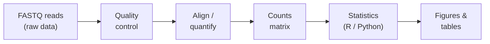
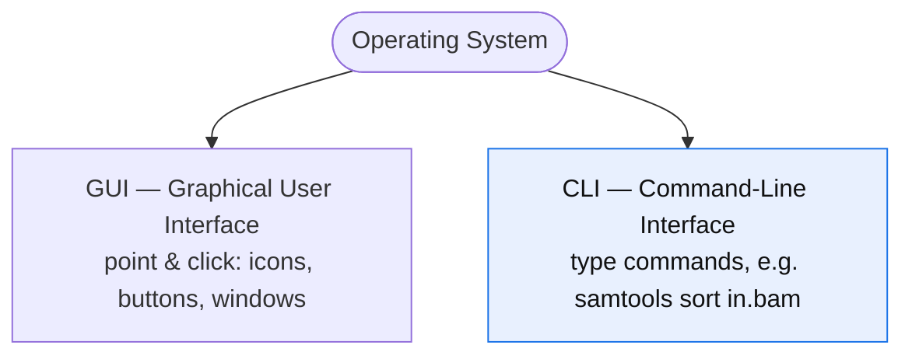
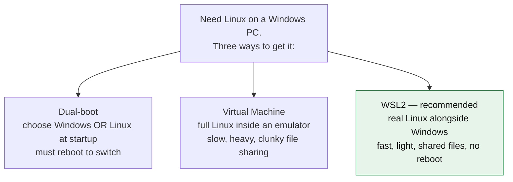
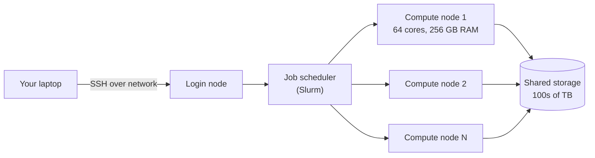
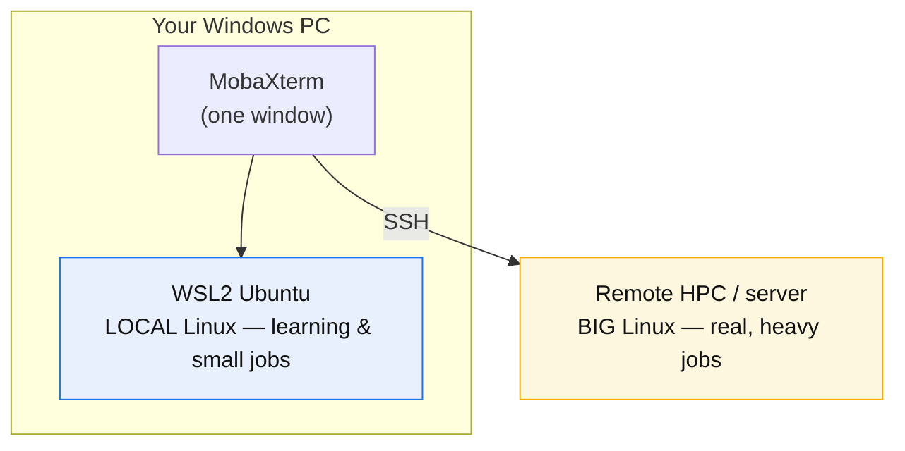
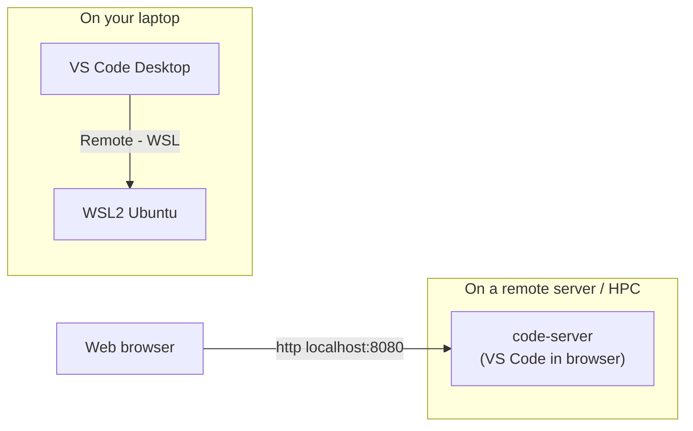
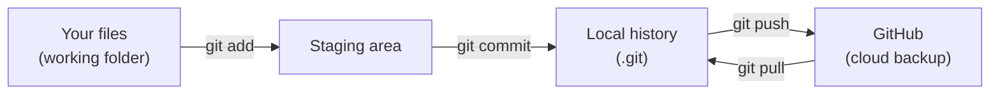

# Day 1 — Bioinformatics Workflow Setup: Building Your Computational Foundation

> **Module:** M0 Setup · **Week 1, Day 1** · **Friday, July 3, 2026**
> **Live:** 2 hours (9:00–11:00) · **Self-study:** 2 hours (reading) · **Total:** 4 hours
> **Session code:** BMP-C02-S01 (Zoom + Recording)
> **Author:** Md. Jubayer Hossain

---

## 1. Learning objectives

By the end of this session you will be able to:

- Explain what a bioinformatics workflow is and why it runs on **Linux**.
- Install **Windows Subsystem for Linux (WSL2)** and open a real Ubuntu terminal on Windows.
- Install **MobaXterm** and use it to reach your Linux shell and log in to a **remote server** over SSH.
- Install **Miniconda** and enable the **Bioconda** channel on Ubuntu.
- Create a **reproducible environment** for bioinformatics tools with `conda`/`mamba` and an `environment.yml` file.
- Create a **reproducible Python project** with `uv` and a lock file.
- Set up **VS Code** (desktop + browser `code-server`) with the Python, Copilot, Claude Code, and Bio-Data-Hub extensions.
- Install **R 4.6.1** and **RStudio** (Desktop + Server).
- Use **Git** and **GitHub** for version control, and write documentation in **Markdown**.

## 2. Prerequisites

- **Prior sessions:** none — this is Day 1.
- **A Windows 10 (build 19041+) or Windows 11 PC** with administrator rights and internet.
- **~10 GB free disk** and the patience to reboot once.
- **Self-check** — open **PowerShell** and confirm your Windows build is new enough for WSL2:

```powershell
winver
```

A small window shows your version. You need **Version 2004 (build 19041)** or newer. Anything from 2021 onward is fine.

## 3. Why this matters

Almost every bioinformatics tool — aligners, variant callers, RNA-seq quantifiers — is written for **Linux**. Papers publish Linux commands; servers and cloud clusters run Linux; Bioconda ships Linux binaries. If you can drive a Linux terminal and install tools **reproducibly** (so your analysis runs the same way next month and on someone else's machine), you can run essentially any published pipeline. Today you build that foundation once, and reuse it for all 24 sessions.

## 4. Concept primer

This section answers the big "what" and "why" questions **before** you touch a single command. Read it slowly — everything else today builds on these ideas.

### 4.1 What is a bioinformatics workflow?

A bioinformatics analysis is a **chain**: raw data goes in one end, results come out the other, and each link is a separate program. Example RNA-seq chain:



Each box is a program you install and run. **Almost all of those programs are built for Linux.** So the first question is: what is Linux, and why does biology run on it?

---

### 4.2 What is Linux?

**Linux is an operating system** — the master software that runs a computer — just like Windows and macOS are operating systems. The difference: Linux is **free**, **open-source** (anyone can read and change its code), and you drive it mostly by **typing commands** instead of clicking.

Think of the operating system as the ground floor everything else stands on:

```
   ┌─────────────────────────────────────────┐
   │   Your programs (samtools, R, Python)    │  ← the tools you run
   ├─────────────────────────────────────────┤
   │   Operating System (Linux / Windows)     │  ← manages files, memory, CPU
   ├─────────────────────────────────────────┤
   │   Hardware (CPU, RAM, disk)              │  ← the physical machine
   └─────────────────────────────────────────┘
```

Two ways to give an OS orders:



- **GUI** = *Graphical User Interface* — icons and buttons (what you use on Windows daily).
- **CLI** = *Command-Line Interface* — you type instructions. Bioinformatics lives here.

### 4.3 Why Linux for bioinformatics?

| Reason | What it means for you |
|--------|-----------------------|
| **Tools are built for it** | Aligners, variant callers, Bioconda's ~10,000 packages ship as Linux binaries first (often *only*). |
| **Free & no admin walls** | Install thousands of tools without buying licenses or fighting admin permissions. |
| **Reproducible & scriptable** | A workflow is just text commands — save them, re-run them, share them, and get identical results. |
| **It runs the big machines** | Lab servers, HPC clusters, and cloud (AWS/Google) are ~all Linux. Learn it once, use it everywhere. |
| **What papers publish** | Methods sections list Linux commands. You can reproduce published pipelines directly. |

> **Bottom line:** you cannot avoid Linux in bioinformatics — so we make it easy to get, starting now.

---

### 4.4 What is WSL? Why WSL?

Problem: bioinformatics needs Linux, but your laptop runs **Windows**. You have three ways to get Linux onto a Windows PC:



**WSL = Windows Subsystem for Linux.** Version 2 (**WSL2**) runs a **real Ubuntu Linux kernel** seamlessly inside Windows — no separate boot, no clunky emulator. You open a terminal and you are *in Linux*, while Windows keeps running normally beside it.

**Why WSL (over the other two):**

- **No reboot** — Linux and Windows run at the same time.
- **Fast & light** — near-native speed, minimal setup.
- **Shared files** — your Windows files are reachable from Linux and vice-versa.
- **Free & official** — built and maintained by Microsoft; one command installs it.

```
        Your Windows Laptop
   ┌───────────────────────────────┐
   │  Windows apps   │   WSL2       │
   │  (browser,      │   Ubuntu     │
   │   Office, …)    │   (Linux     │
   │                 │    terminal) │
   └───────────────────────────────┘
        both run at the same time
```

So: **WSL2 = your personal Linux, living inside Windows.** This is your *local* Linux for everyday work.

---

### 4.5 What is HPC? Why HPC?

Your laptop is fine for learning, but real datasets are **big** — aligning a human genome can need 32+ GB of RAM and many CPU cores, running for hours. A laptop chokes. Enter **HPC**.

**HPC = High-Performance Computing.** An HPC **cluster** is a large collection of powerful computers ("nodes") wired together in a data center, sharing huge storage — designed to run heavy jobs fast, for many users at once.



Laptop vs HPC, at a glance:

```
   Laptop                         HPC cluster
   ┌──────────┐                   ┌──────────┬──────────┬──────────┐
   │ 4–8 cores│                   │ 64 cores │ 64 cores │ 64 cores │
   │ 8–16 GB  │        vs         │  256 GB  │  256 GB  │  256 GB  │  … ×100s
   │ 1 disk   │                   │   shared petabyte storage      │
   └──────────┘                   └──────────┴──────────┴──────────┘
   good for learning              good for real genomics at scale
```

**Why HPC:**

- **Power** — dozens of cores and hundreds of GB of RAM per node handle genome-scale data.
- **Speed & parallelism** — run many samples at once instead of one-by-one on a laptop.
- **Big storage** — datasets are hundreds of GB to TB; clusters have the room.
- **Runs unattended** — submit a job, log off, collect results later.

**How you reach an HPC:** you do **not** sit in front of it. You connect **remotely from your laptop using SSH** (Step 3). The HPC runs Linux — which is exactly why Steps 1–2 (WSL + MobaXterm) matter: the same Linux skills work locally *and* on the cluster.

---

### 4.6 Putting it together — the two Linuxes

You will use **two** Linux environments, driven from one MobaXterm window:



Same commands, same tools, two places to run them. Today you set up **both paths**.

---

### 4.7 Key terms (all repeated in the Glossary)

- **Operating system (OS)** — master software running a computer (Linux, Windows, macOS).
- **Linux** — free, open-source, command-driven OS that bioinformatics tools target.
- **Terminal / shell** — text window where you type commands; Linux default is **bash**.
- **GUI vs CLI** — point-and-click vs typing commands.
- **WSL2** — *Windows Subsystem for Linux v2*; real Ubuntu inside Windows — your **local** Linux.
- **HPC** — *High-Performance Computing*; a cluster of powerful Linux machines for heavy jobs.
- **SSH** — *Secure Shell*; open a terminal on **another** computer (a server/HPC) over the network.
- **MobaXterm** — Windows app combining local shells, SSH sessions, and file transfer.
- **conda** — installs software + dependencies into isolated **environments**, no admin needed.
- **Bioconda** — a **channel** (catalog) of ~10,000 bioinformatics tools installable via conda.
- **Reproducible** — anyone recreates the same tool versions from a small text file (`environment.yml`, `uv.lock`).

## 5. Setup check

You only need Windows + internet to start. Confirm internet and admin PowerShell:

Open **Start → type "PowerShell" → right-click → Run as administrator**. Then:

```powershell
wsl --status
```

Expected output (before install it may say WSL is not installed — that is fine, we fix it in Step 1):

```
Default Distribution: <none or Ubuntu>
Default Version: 2
```

✅ **Checkpoint:** an admin PowerShell window is open and responds.

## 6. Step-by-step walkthrough

### Step 1 — Install Windows Subsystem for Linux (WSL2 + Ubuntu)

**What & why:** this installs a real Ubuntu Linux inside Windows — your everyday terminal for the whole program.

In the **administrator PowerShell**, run:

```powershell
wsl --install
```

This one command enables the needed Windows features, installs WSL2, and installs **Ubuntu** by default.

**Expected output** (abridged):

```
Installing: Virtual Machine Platform
Installing: Windows Subsystem for Linux
Installing: Ubuntu
The requested operation is successful. Changes will not be effective until the system is rebooted.
```

**Reboot your PC now.** After reboot, Ubuntu launches automatically and asks you to create a Linux user:

```
Enter new UNIX username: student
New password:
Retype new password:
```

> The password is **invisible as you type** — that is normal Linux behavior, not a frozen screen. Remember this password; you need it for `sudo` (admin) commands.

Verify the version is **2**:

```powershell
wsl --list --verbose
```

**Expected output:**

```
  NAME      STATE           VERSION
* Ubuntu    Running         2
```

If it shows `VERSION 1`, upgrade it:

```powershell
wsl --set-version Ubuntu 2
wsl --set-default-version 2
```

Now update Ubuntu's own package list (inside the Ubuntu terminal):

```bash
sudo apt update && sudo apt upgrade -y
```

✅ **Checkpoint:** `wsl -l -v` shows Ubuntu, State **Running**, Version **2**, and you have a bash prompt like `student@PC:~$`.

---

### Step 2 — Install MobaXterm (Windows)

**What & why:** WSL gives you a terminal, but **MobaXterm** gives you one comfortable window for your WSL shell, remote SSH servers, and drag-and-drop file transfer — the tool you'll live in for remote work.

1. Open a browser to **https://mobaxterm.mobatek.net/download-home-edition.html**.
2. Download **MobaXterm Home Edition → Installer edition** (not the Portable edition, so it stays installed).
3. Unzip the downloaded file, run the `.msi` installer, click **Next → Next → Install → Finish**.
4. Launch **MobaXterm** from the Start menu.

**What you should see:** a window with a left **Sessions** sidebar and a big terminal area. MobaXterm auto-detects your **WSL Ubuntu** — look under the left sidebar for a **WSL / Ubuntu** entry.

Open your local Linux inside MobaXterm:

- Click the **WSL** icon (or **Session → WSL → Ubuntu → OK**).

```bash
lsb_release -a
```

**Expected output:**

```
Distributor ID: Ubuntu
Description:    Ubuntu 22.04.x LTS
Release:        22.04
Codename:       jammy
```

✅ **Checkpoint:** MobaXterm is open and shows your Ubuntu bash prompt.

---

### Step 3 — Remote login using MobaXterm (SSH)

**What & why:** real analyses often run on a **remote server** (a lab machine or cloud instance) with more CPU/RAM than your laptop. SSH is how you open a terminal there. *(If your mentor has not given you a server yet, read this step now and practice it when you receive credentials — it is required knowledge, not optional.)*

You need three things from whoever owns the server: **host** (an address like `hpc.university.edu` or an IP `203.0.113.10`), your **username**, and either a **password** or an **SSH key**.

**Create an SSH session in MobaXterm:**

1. Click **Session** (top-left) → **SSH**.
2. **Remote host:** paste the host, e.g. `hpc.university.edu`.
3. Tick **Specify username** → type your server username.
4. Leave **Port** at `22` (the standard SSH port).
5. Click **OK**.

MobaXterm connects and prompts:

```
login as: <username>
<username>@hpc.university.edu's password:
```

Type your password (invisible) and press Enter.

**Expected output** (a welcome banner + a prompt on the *remote* machine):

```
Welcome to the Bio-HPC cluster
Last login: Fri Jul  3 09:12:03 2026 from 203.0.113.5
<username>@hpc:~$
```

Confirm you are really on the remote machine, not your laptop:

```bash
hostname
```

**Expected output:**

```
hpc
```

**Move a file to the server:** MobaXterm shows an SFTP file browser on the left — **drag a file from Windows into it** to upload, or from it to Windows to download. Command-line equivalent, run from your **WSL** terminal:

```bash
scp myfile.txt <username>@hpc.university.edu:/home/<username>/
```

> **Key-based login (recommended, no password each time).** Generate a key once in WSL, then copy the public half to the server:
> ```bash
> ssh-keygen -t ed25519 -C "you@example.com"   # press Enter for defaults
> ssh-copy-id <username>@hpc.university.edu        # paste password once
> ssh <username>@hpc.university.edu                 # now logs in with no password
> ```

✅ **Checkpoint:** `hostname` on the SSH session prints the **server's** name, different from your laptop.

---

### Step 4 — Install Miniconda on Ubuntu

**What & why:** **Miniconda** is a minimal installer for `conda`. It lets you install thousands of tools into isolated environments **without admin rights** — critical on shared servers where you cannot `sudo`.

Run these **in your Ubuntu (WSL) terminal**. First download the Linux 64-bit installer:

```bash
cd ~
wget https://repo.anaconda.com/miniconda/Miniconda3-latest-Linux-x86_64.sh
```

**Expected output** (ends with):

```
'Miniconda3-latest-Linux-x86_64.sh' saved
```

Run the installer:

```bash
bash Miniconda3-latest-Linux-x86_64.sh
```

- Press **Enter** to read the license, hold **Enter/Space** to scroll, type **yes** to accept.
- Accept the default install location (`/home/<username>/miniconda3`) with **Enter**.
- When asked *"Do you wish to update your shell profile to automatically initialize conda?"* type **yes**.

Reload your shell so `conda` is on the PATH:

```bash
source ~/.bashrc
```

Verify:

```bash
conda --version
```

**Expected output:**

```
conda 24.x.x
```

Stop conda from auto-activating `base` on every new terminal (keeps prompts clean):

```bash
conda config --set auto_activate_base false
```

✅ **Checkpoint:** `conda --version` prints a version number.

---

### Step 5 — Install Bioconda on Ubuntu (channels + fast solver)

**What & why:** **Bioconda** is the catalog of bioinformatics tools. You enable it by adding three **channels** in the correct priority, then install the fast **mamba** solver so environment-building takes seconds instead of minutes.

Add the channels **in this exact order** (order sets priority):

```bash
conda config --add channels defaults
conda config --add channels bioconda
conda config --add channels conda-forge
conda config --set channel_priority strict
```

> Order matters: after these commands `conda-forge` is highest priority, then `bioconda`, then `defaults`. `strict` priority is the officially recommended Bioconda setup and prevents most "unsolvable environment" errors.

Confirm the channel list:

```bash
conda config --show channels
```

**Expected output:**

```
channels:
  - conda-forge
  - bioconda
  - defaults
```

Install **mamba** (a drop-in, much faster replacement for `conda`) into base:

```bash
conda install -n base -c conda-forge mamba -y
```

Test Bioconda by installing a real tool, **samtools**, into a throwaway environment:

```bash
mamba create -n test-bio samtools -y
mamba activate test-bio
samtools --version | head -n 1
```

**Expected output:**

```
samtools 1.x
```

Clean up the test:

```bash
mamba deactivate
mamba env remove -n test-bio -y
```

✅ **Checkpoint:** `samtools --version` printed successfully from a Bioconda-installed package.

---

### Step 6 — Reproducible package management for bioinformatics (`environment.yml`)

**What & why:** typing `mamba install` by hand is not reproducible — you'll forget which versions you used. Instead, describe your tools in a small text file, `environment.yml`, and build the environment **from the file**. Anyone (including future you) recreates the identical toolset with one command.

Create the file with a text editor. In WSL you can use `nano`:

```bash
nano environment.yml
```

Paste this (a starter environment for the RNA-seq sessions):

```yaml
name: bmp-rnaseq
channels:
  - conda-forge
  - bioconda
  - defaults
dependencies:
  - python=3.11
  - samtools=1.20
  - bcftools=1.20
  - bedtools=2.31
  - fastqc=0.12
  - fastp=0.23
  - salmon=1.10
  - multiqc=1.21
```

Save in nano with **Ctrl+O → Enter**, exit with **Ctrl+X**.

Build the environment **from the file**:

```bash
mamba env create -f environment.yml
```

**Expected output** (ends with):

```
done
#
# To activate this environment, use
#     $ mamba activate bmp-rnaseq
```

Activate and verify:

```bash
mamba activate bmp-rnaseq
which samtools
```

**Expected output** (path inside the env, not the system):

```
/home/<username>/miniconda3/envs/bmp-rnaseq/bin/samtools
```

**Export an exact snapshot** so a collaborator gets identical versions:

```bash
mamba env export --no-builds > environment.lock.yml
```

This writes every package and version. Commit `environment.yml` (human-edited) and `environment.lock.yml` (exact snapshot) to git.

> **Modern alternative — Pixi.** Newer projects increasingly use **[Pixi](https://pixi.sh)**, which reads the same conda/bioconda channels but writes a `pixi.lock` automatically and installs into a per-project `.pixi/` folder. Same idea, tighter reproducibility. `conda`/`mamba` + `environment.yml` remains the most widely documented approach and is what we use in this cohort.

✅ **Checkpoint:** `mamba activate bmp-rnaseq` works and `which samtools` points inside `envs/bmp-rnaseq`.

---

### Step 7 — Reproducible package management for Python (`uv`)

**What & why:** conda handles bioinformatics **binaries**; for pure-**Python** projects (pandas, scanpy, your own scripts) the modern reproducible tool is **`uv`** — extremely fast, and it writes a `uv.lock` that pins every dependency for exact reproducibility.

Install `uv` inside WSL:

```bash
curl -LsSf https://astral.sh/uv/install.sh | sh
source ~/.bashrc
uv --version
```

**Expected output:**

```
uv 0.x.x
```

Create a reproducible Python project:

```bash
mkdir ~/bmp-python && cd ~/bmp-python
uv init
uv add pandas numpy matplotlib
```

**Expected output** (abridged):

```
Initialized project `bmp-python`
Resolved N packages ...
Installed N packages
```

`uv` created three key files:

- `pyproject.toml` — your declared dependencies (human-edited).
- `uv.lock` — the exact resolved versions (auto-managed; **commit it**).
- `.venv/` — the isolated virtual environment (do **not** commit).

Run Python inside the project without manually activating anything:

```bash
uv run python -c "import pandas as pd; print(pd.__version__)"
```

**Expected output:**

```
2.x.x
```

A collaborator reproduces your exact environment by cloning the repo and running:

```bash
uv sync
```

✅ **Checkpoint:** `uv run python -c "import pandas"` prints a version, and `uv.lock` exists in the project.

---

### Step 8 — Install a code editor: VS Code (+ extensions, + browser version)

**What & why:** you need a place to **write and run code**. **VS Code** (Visual Studio Code) is the free, standard editor for bioinformatics: it edits files, opens a terminal, connects straight into WSL, and adds superpowers through **extensions** (small add-ons). There are two forms:

- **VS Code Desktop** — installed app on Windows; connects into WSL. Use on your laptop.
- **code-server** — *VS Code running in a web browser*, installed on a Linux server/HPC. Use when you only have a browser to reach a remote machine.



**8a. VS Code Desktop on Windows**

1. Download from **https://code.visualstudio.com** → run installer → tick *"Add to PATH"* → Finish.
2. Install the **WSL** extension so VS Code can open Linux files: press `Ctrl+Shift+X`, search **WSL** (publisher Microsoft), click **Install**.
3. From your **WSL terminal**, open the current folder in VS Code:

```bash
cd ~ && code .
```

The first run downloads a small server into WSL. VS Code opens with a green **`WSL: Ubuntu`** badge in the bottom-left corner — that means you are editing Linux files.

✅ **Checkpoint:** VS Code window shows **`WSL: Ubuntu`** in the bottom-left.

**8b. Install the required extensions**

Install from the UI (`Ctrl+Shift+X`, search the name, **Install**) **or** from the terminal. Command-line install:

```bash
code --install-extension ms-python.python      # Python: run/debug .py, notebooks, envs
code --install-extension GitHub.copilot        # GitHub Copilot: AI code completion
code --install-extension anthropic.claude-code # Claude Code for VS Code: AI pair-programmer
```

- **Python** (`ms-python.python`) — runs and debugs Python, picks your conda/`uv` environment, opens Jupyter notebooks.
- **GitHub Copilot** (`GitHub.copilot`) — AI autocompletion; needs a GitHub account (Step 10) and a Copilot subscription (free for students/educators).
- **Claude Code for VS Code** (`anthropic.claude-code`) — Anthropic's AI assistant inside the editor.
- **Bio-Data-Hub** — a bioinformatics data/browser helper. Install from the UI: open Extensions (`Ctrl+Shift+X`), search **Bio-Data-Hub**, click **Install** (the Marketplace page has the exact publisher — use that so you get the right one).

Verify the Python extension sees your environment: open a `.py` file, then bottom-right click the interpreter picker and choose your `bmp-rnaseq` conda env or `.venv`.

✅ **Checkpoint:** all four extensions show **Installed** in the Extensions panel.

**8c. code-server (VS Code in the browser) — for remote/HPC use**

Run this **on the Linux machine you want to edit on** (your WSL, or a remote server via SSH):

```bash
curl -fsSL https://code-server.dev/install.sh | sh
```

Start it:

```bash
code-server
```

**Expected output:**

```
[info] code-server 4.x.x
[info] HTTP server listening on http://127.0.0.1:8080/
[info] Session password is in the config file: ~/.config/code-server/config.yaml
```

Get the auto-generated password:

```bash
cat ~/.config/code-server/config.yaml
```

Open a browser to **http://localhost:8080**, paste the password — you now have full VS Code in the browser. (On a remote server, forward the port first: `ssh -L 8080:localhost:8080 user@host`.)

✅ **Checkpoint:** browser at `localhost:8080` shows the VS Code interface.

---

### Step 9 — Install R and RStudio

**What & why:** **R** is the statistics language behind most RNA-seq analysis (DESeq2, edgeR, Seurat). **RStudio** is the friendly workbench (IDE) for writing R — editor, console, plots, and data viewer in one window. Two forms, mirroring Step 8:

- **RStudio Desktop** — installed on Windows; for local work.
- **RStudio Server** — runs on a Linux server/HPC; you use it through a browser.

**9a. R for Windows**

1. Go to **https://cran.r-project.org/bin/windows/base/** and download **R-4.6.1 for Windows**.
2. Run the installer, accept defaults, Finish.

**9b. RStudio Desktop**

1. Go to **https://posit.co/download/rstudio-desktop/** → download the Windows installer → install.
2. Launch **RStudio**. In the **Console** pane type:

```r
R.version.string
```

**Expected output:**

```
[1] "R version 4.6.1 (2026-xx-xx)"
```

Install a first R package to confirm CRAN works:

```r
install.packages("tidyverse")
```

**9c. R + RStudio Server on Ubuntu (WSL or HPC)**

Install R on Ubuntu:

```bash
sudo apt update
sudo apt install -y r-base
R --version | head -n 1
```

**Expected output:**

```
R version 4.6.1 (2026-xx-xx) -- "..."
```

Install **RStudio Server** (browser-based R for a Linux server):

```bash
sudo apt install -y gdebi-core
wget https://download2.rstudio.org/server/jammy/amd64/rstudio-server-latest-amd64.deb
sudo gdebi -n rstudio-server-latest-amd64.deb
```

It starts automatically. Open a browser to **http://localhost:8787** and log in with your **Linux username + password** (from Step 1).

✅ **Checkpoint:** `R.version.string` reports **4.6.1**, and (server) `localhost:8787` shows the RStudio login.

> **Bioconductor** — the R home of bioinformatics packages (DESeq2, etc.). You'll install these on Day 7/9; the installer is:
> ```r
> install.packages("BiocManager")
> BiocManager::install("DESeq2")
> ```

---

### Step 10 — Install Git and create a GitHub account

**What & why:** **Git** is version control — it records the history of your files so you can undo changes, work in parallel, and collaborate. **GitHub** is a website that hosts Git repositories online (backup + sharing). Together they are how bioinformaticians share code and how you'll submit exercises.



**10a. Install Git**

- **On Windows:** download from **https://git-scm.com/download/win**, run the installer, accept defaults.
- **In WSL/Ubuntu:** Git is usually preinstalled. Confirm / install:

```bash
git --version || sudo apt install -y git
```

**Expected output:**

```
git version 2.4x.x
```

Tell Git who you are (used to label your commits):

```bash
git config --global user.name "Md. Jubayer Hossain"
git config --global user.email "you@example.com"
git config --global init.defaultBranch main
```

**10b. Create a GitHub account**

1. Go to **https://github.com/signup**.
2. Enter email, password, and a username (use a professional one — it appears on your work).
3. Verify your email.
4. Students: apply for the free **GitHub Student Developer Pack** (includes free Copilot) at **https://education.github.com**.

**10c. Connect your machine to GitHub (SSH key)**

Reuse the SSH key from Step 3 (or make one), then add its **public** half to GitHub:

```bash
cat ~/.ssh/id_ed25519.pub   # if missing: ssh-keygen -t ed25519 -C "you@example.com"
```

Copy the printed line → GitHub → **Settings → SSH and GPG keys → New SSH key** → paste → save. Test:

```bash
ssh -T git@github.com
```

**Expected output:**

```
Hi <username>! You've successfully authenticated, but GitHub does not provide shell access.
```

✅ **Checkpoint:** `ssh -T git@github.com` greets you by your GitHub username.

---

### Step 11 — Markdown syntax

**What & why:** **Markdown** is a tiny "plain-text formatting" language — you write readable text with a few symbols (`#`, `*`, `` ` ``) and it renders as headings, lists, code, and tables. Every `README`, these guides, and GitHub pages are Markdown. It is the standard way to document analyses.

Core syntax (full reference in **`resources/markdown-cheatsheet.pdf`**):

| You type | You get |
|----------|---------|
| `# Title` / `## Section` | Headings (levels 1–6) |
| `**bold**` , `*italic*` | **bold**, *italic* |
| `- item` | Bulleted list |
| `1. item` | Numbered list |
| `` `code` `` | inline `code` |
| ` ```bash … ``` ` | fenced code block (with language) |
| `[text](https://url)` | a link |
| `` | an image |
| `| a | b |` rows | a table |
| `> quote` | a block quote |

Practice: create `notes.md`, paste a heading and a list, and **preview** it in VS Code with `Ctrl+Shift+V`.

```bash
printf '# My first note\n\n- learned WSL\n- learned conda\n' > notes.md
```

✅ **Checkpoint:** VS Code preview (`Ctrl+Shift+V`) shows a formatted heading and bullet list.

---

### Step 12 — Git and GitHub basics (the everyday workflow)

**What & why:** this is the loop you'll repeat forever: change files → **stage** → **commit** (save a snapshot) → **push** (upload to GitHub). Full command reference in **`resources/git-cheat-sheet-education.pdf`**.

**Start a new project and make your first commit:**

```bash
mkdir ~/day1-practice && cd ~/day1-practice
git init                                  # create a new repository
echo "# Day 1 Practice" > README.md       # add a file
git status                                 # see what changed (red = untracked)
git add README.md                          # stage the file (green)
git commit -m "First commit: add README"   # save a snapshot to local history
```

**Expected output** (from commit):

```
[main (root-commit) 1a2b3c4] First commit: add README
 1 file changed, 1 insertion(+)
```

**Put it on GitHub:**

1. On GitHub click **New repository** → name it `day1-practice` → **Create** (do not add a README there).
2. Connect and upload:

```bash
git remote add origin git@github.com:<your-username>/day1-practice.git
git branch -M main
git push -u origin main
```

**The daily loop afterward:**

```bash
git pull            # get latest from GitHub (start of session)
# ... edit files ...
git add -A          # stage everything changed
git commit -m "message describing what you did"
git push            # upload
```

**Clone an existing repo** (e.g. course materials):

```bash
git clone git@github.com:<owner>/<repo>.git
```

✅ **Checkpoint:** refresh your GitHub repo page in the browser — your `README.md` and commit message appear online.

---

## 7. Common errors & troubleshooting

| Error message | Cause | Fix |
|---------------|-------|-----|
| `wsl --install` says *"the feature is not installed"* / nothing happens | Virtualization disabled in BIOS, or old Windows | Enable **Virtualization** in BIOS; run **Windows Update**; then re-run `wsl --install`. |
| `WslRegisterDistribution failed with error: 0x800701bc` | WSL2 kernel outdated | Run `wsl --update` in admin PowerShell, then restart. |
| `conda: command not found` after install | Shell profile not reloaded | Run `source ~/.bashrc`, or close and reopen the terminal. |
| `PackagesNotFoundError` / `Solving environment: failed` | Channels missing or wrong priority | Re-run the Step 5 channel commands; ensure `channel_priority strict`; use `mamba` not `conda`. |
| `Permission denied` on `apt` commands | Missing `sudo` | Prefix with `sudo` (system packages). Conda/Bioconda tools need **no** sudo. |
| SSH: `Connection timed out` | Wrong host/port, or firewall/VPN | Verify host + port `22` with your admin; connect to campus VPN if required. |
| SSH: `Permission denied (publickey,password)` | Wrong username/password or key not copied | Recheck credentials; run `ssh-copy-id user@host` to install your key. |
| `uv: command not found` after install | PATH not reloaded | `source ~/.bashrc` or reopen the terminal. |
| `code: command not found` in WSL | VS Code PATH not shared to WSL | Install VS Code Desktop on Windows with *Add to PATH*, reopen the WSL terminal. |
| `git push` → `Permission denied (publickey)` | SSH key not added to GitHub | Add `~/.ssh/id_ed25519.pub` to GitHub → Settings → SSH keys; test `ssh -T git@github.com`. |
| `fatal: remote origin already exists` | `git remote add` run twice | Use `git remote set-url origin <url>` instead. |
| RStudio Server `localhost:8787` won't load | Service not started / wrong port | `sudo rstudio-server start`; on remote, forward the port with `ssh -L 8787:localhost:8787 user@host`. |
| R `install.packages` fails to compile | Missing build tools on Ubuntu | `sudo apt install -y build-essential r-base-dev`. |

## 8. Exercises

Attempt these before opening `solutions/`. They go from guided to independent.

1. **(Guided)** Prove your local Linux works: in WSL run `uname -a` and `nproc`, and report your kernel string and CPU-core count.
2. **(Guided)** Create a conda environment named `bmp-qc` containing only `fastqc` and `multiqc` from Bioconda, activate it, and paste the output of `fastqc --version`.
3. **(Semi-guided)** Write an `environment.yml` that pins `python=3.10` plus `pysam` and `seqkit`. Build it with `mamba env create -f`, then export `environment.lock.yml`. Submit both files.
4. **(Independent)** Start a `uv` project called `day1-practice`, add `biopython`, and write a 3-line script that prints the reverse-complement of `ATGC`. Run it with `uv run`. Submit the script and its output.
5. **(Guided)** Install the four VS Code extensions (Python, Copilot, Claude Code, Bio-Data-Hub). Open a `.py` file and select your `bmp-rnaseq` conda environment as the interpreter. Screenshot the interpreter shown bottom-right.
6. **(Semi-guided)** In RStudio (Desktop or Server) run `R.version.string` and `sessionInfo()`; paste the R version line.
7. **(Independent)** Create a GitHub repo named `bmp-day1`, write a `README.md` in Markdown with a heading, a bullet list of what you installed today, and one link. Commit and **push** it. Submit the repository URL.

## 9. Recap / key takeaways

- Bioinformatics tools run on **Linux**; **WSL2** puts real Ubuntu inside Windows.
- **MobaXterm** unifies your local WSL shell, remote **SSH** servers, and file transfer.
- **Miniconda + Bioconda** install ~10,000 tools with no admin rights; **mamba** solves fast.
- Reproducibility = describe tools in a file: **`environment.yml`** (conda/bioconda) and **`uv.lock`** (Python). Commit these to git.

## 10. Glossary

| Term | Meaning |
|------|---------|
| Operating system (OS) | Master software running a computer (Linux, Windows, macOS). |
| Linux | Free, open-source, command-driven OS that bioinformatics tools target. |
| GUI vs CLI | Point-and-click interface vs typing commands (Command-Line Interface). |
| HPC | High-Performance Computing — a cluster of powerful Linux machines for heavy jobs. |
| Node | One computer within an HPC cluster. |
| Terminal / shell | Text window for typing commands; Linux default is **bash**. |
| WSL2 | Windows Subsystem for Linux v2 — real Ubuntu running inside Windows. |
| Ubuntu | The Linux distribution WSL installs by default. |
| SSH | Secure Shell — open a terminal on a remote computer securely. |
| MobaXterm | Windows app combining local shells, SSH sessions, and file transfer. |
| `sudo` | "Superuser do" — run one command with admin rights (needs your Linux password). |
| conda | Tool that installs software + dependencies into isolated environments, no admin needed. |
| Miniconda | Minimal installer that provides `conda`. |
| Bioconda | Channel (catalog) of bioinformatics tools installable via conda. |
| channel | A repository conda searches for packages. |
| mamba | Fast drop-in replacement for the `conda` command. |
| environment | An isolated set of installed tools/versions, separate from the system. |
| `environment.yml` | Text file listing an environment's channels + packages; used to rebuild it. |
| uv | Fast, reproducible package/project manager for Python; writes `uv.lock`. |
| lock file | File pinning exact dependency versions for reproducibility (`uv.lock`, `environment.lock.yml`). |
| VS Code | Free code editor; connects to WSL and extends via extensions. |
| code-server | VS Code running in a web browser, for editing on a remote Linux server. |
| extension | A small add-on that gives VS Code new abilities (Python, Copilot, etc.). |
| R | Statistics programming language behind most RNA-seq analysis. |
| RStudio | The IDE (workbench) for writing R; Desktop (local) or Server (browser). |
| Bioconductor | R's repository of bioinformatics packages (DESeq2, edgeR, …). |
| Git | Version control — records file history; undo, branch, collaborate. |
| GitHub | Website that hosts Git repositories online for backup and sharing. |
| repository (repo) | A project folder tracked by Git. |
| commit | A saved snapshot of your files at one point in time. |
| push / pull | Upload commits to GitHub / download commits from GitHub. |
| clone | Download a full copy of a GitHub repository. |
| Markdown | Plain-text formatting language for docs and READMEs (`.md`). |

## 11. Further reading

- WSL install docs — https://learn.microsoft.com/windows/wsl/install
- MobaXterm documentation — https://mobaxterm.mobatek.net/documentation.html
- Bioconda: usage & channel setup — https://bioconda.github.io/
- Miniconda — https://docs.anaconda.com/miniconda/
- uv documentation — https://docs.astral.sh/uv/
- Pixi (modern conda-based reproducibility) — https://pixi.sh/
- VS Code — https://code.visualstudio.com/docs ; code-server — https://coder.com/docs/code-server
- R (CRAN) — https://cran.r-project.org/ ; RStudio — https://posit.co/download/rstudio-desktop/
- Git handbook — https://docs.github.com/get-started ; GitHub Student Pack — https://education.github.com
- Markdown guide — https://www.markdownguide.org/basic-syntax/

## 12. What's next

Day 2 — **Command Line Tools for Omics: Basic Unix commands + NGS Data Formats.** Now that you have a Linux terminal and can install tools, you'll learn the core Unix commands and meet the file formats (FASTA/FASTQ) that every pipeline reads.
