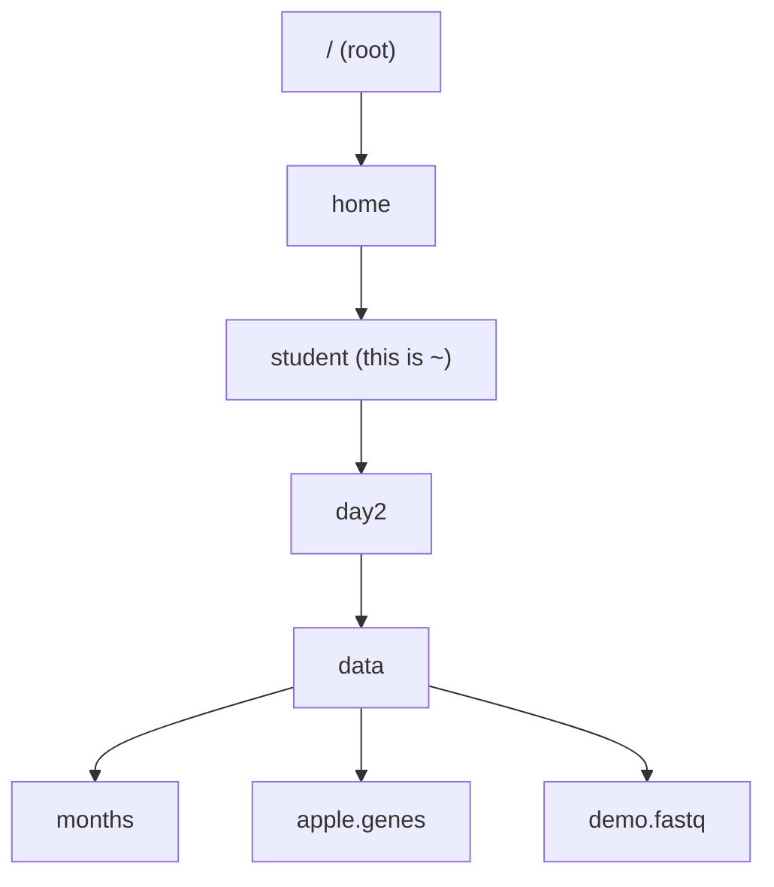
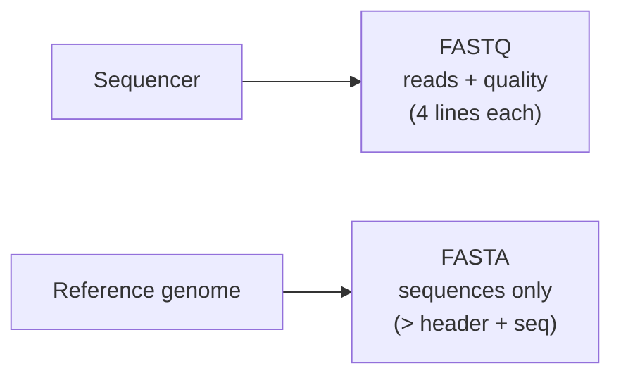

# Day 2 — Command Line: Basic Unix + NGS Data Formats

> **Module:** M1 Linux · **Week 1, Day 2** · **Saturday, July 4, 2026**
> **Live:** 2 hours (9:00–11:00) · **Self-study:** 3 hours (practice) · **Total:** 5 hours
> **Session code:** BMP-C02-S02 (Zoom + Recording)
> **Author:** Md. Jubayer Hossain

---

## 1. Learning objectives

By the end of this session you will be able to:

- Navigate the Linux filesystem with `pwd`, `ls`, and `cd`, and describe an **absolute vs relative path**.
- Match many files at once with **wildcards / globbing** (`*`, `?`, `[]`, `{}`).
- Create, copy, move, rename, and remove files and folders (`mkdir`, `touch`, `cp`, `mv`, `rm`, `rmdir`).
- Inspect text files with `cat`, `more`, `less`, `head`, `tail`, and count with `wc`.
- Chain commands with **pipes** (`|`) and route the **standard streams** with `<`, `>`, `>>`.
- Filter, cut, sort, de-duplicate, and compare content with `grep`, `cut`, `sort`, `uniq`, `diff`, `comm`.
- Compress and archive data with `gzip`/`gunzip`, `bzip2`/`bunzip2`, and `tar`.
- Read and recognise the two most common raw NGS formats — **FASTA** and **FASTQ** — and count sequences/reads from the command line.

## 2. Prerequisites

- **Prior sessions:** Day 1 (WSL2 + Ubuntu terminal, conda, git). You need a working **bash** prompt.
- **Tools installed:** only the coreutils that ship with Ubuntu (`ls`, `grep`, `cut`, `sort`, `uniq`, `wc`, `diff`, `comm`, `gzip`, `tar`). No conda env needed today.
- **Self-check** — open your WSL Ubuntu terminal; if this prints a bash version you are ready:

```bash
bash --version | head -n 1
```

Expected:

```
GNU bash, version 5.1.16(1)-release (x86_64-pc-linux-gnu)
```

## 3. Why this matters

Every bioinformatics pipeline starts as **plain text files** — a genome is text, sequencing reads are text, gene annotations are text. Before you run a single specialised tool (aligner, variant caller, RNA-seq quantifier), you need to *look* at those files, check they are not corrupt, count how many reads you got, pull out the columns you care about, and compress them for storage. The Unix command line does all of this in seconds on files too big to open in Excel. A 431 MB FASTQ file of 1.25 million reads (you will use exactly that today) cannot be double-clicked open — but `head`, `wc`, and `grep` handle it instantly. Master these ~20 commands and you can drive any published Linux pipeline.

## 4. Concept primer

Read this before touching a command. Everything today builds on these ideas. Today's dataset is a **toy "Plants" collection** — genomes, gene annotations, and sample lists for toy *apple*, *pear*, and *peach* — small enough to reason about, real enough to behave like genomic data.

### 4.1 The shell, commands, and arguments

The **shell** (bash) is the program that reads what you type and runs it. You type a **command**, optionally followed by **options** (flags, like `-l`) and **arguments** (what to act on, like a filename):

```
   command   option   argument
     ls        -l       months
```

- **Command** = the program (`ls`).
- **Option / flag** = changes behaviour, usually starts with `-` (`-l` = "long listing").
- **Argument** = the thing acted on (a file or folder).

Press **Enter** to run. The shell prints output, then shows a new **prompt** (ending in `$`) waiting for the next command.

### 4.2 The filesystem is a tree

Linux organises everything into one upside-down tree of **directories** (folders) starting at the **root**, written `/`. Your personal folder is your **home**, written `~` (e.g. `/home/<username>`).



- **Absolute path** — the full address from root: `/home/<username>/day2/data/months`.
- **Relative path** — from where you currently are: if you are in `day2`, then `data/months` points to the same file.
- `.` means "here" (current directory); `..` means "one level up".

### 4.3 Wildcards (globbing)

The shell expands special characters into **lists of matching filenames** *before* the command runs. This is called **globbing**:

| Pattern | Matches | Example |
|---------|---------|---------|
| `*` | any run of characters (incl. none) | `*.genes` → all files ending `.genes` |
| `?` | exactly one character | `pea?.genes` → `pear.genes` (not `peach.genes`) |
| `[...]` | one character from a set | `apple.condition[AB]` → `...A` and `...B` |
| `{a,b}` | any of the comma-listed strings | `*.{fasta,samples}` → both extensions |

Globbing works with **any** command (`ls *.genes`, `wc -l *.samples`, `rm *.tmp`), which is why one command can act on hundreds of files.

### 4.4 Streams, pipes, and redirection

Every command reads an input stream and writes two output streams:

- **stdin** — standard input (what goes in).
- **stdout** — standard output (normal results).
- **stderr** — standard error (error messages), kept separate so errors don't pollute your data.

The power of Unix is **connecting** commands so one's output becomes the next one's input:


- **Pipe** `|` — send the left command's stdout into the right command's stdin.
- **Redirect** `>` — send stdout into a **file** (overwrites it).
- **Append** `>>` — send stdout to the **end** of a file (keeps existing content).
- **Input** `<` — feed a **file** into a command's stdin.

This "small tools, glued together" philosophy is why Unix dominates bioinformatics.

### 4.5 NGS data formats: FASTA and FASTQ

A **sequencing run** produces text files. The two you meet first:

**FASTA** — stores sequences (a genome, genes, proteins). Each record is 2+ lines:

```
>AB362210.1 Dengue virus 3 ...   ← header line, ALWAYS starts with ">"
AGCGGAGTCTCATGGATAATGAAAATTGG    ← sequence (one or more lines)
```

- The `>` line is the **header** (an ID + free-text description).
- To **count sequences** in a FASTA: count the `>` lines.

**FASTQ** — stores sequencing **reads** plus a **quality score** per base. Each read is **exactly 4 lines**:

```
@SRR960459.1 HWI-ST330:... length=100   ← 1. header, starts with "@"
NAGAACTTGGCGGCGAATGGGCTGACCGCT...        ← 2. the DNA sequence
+                                         ← 3. separator, starts with "+"
#1=DDFFFHHHGHIJJJJIJJJGEGGAFGB...         ← 4. quality string, one char per base
```

- Because every read is **4 lines**, `number of reads = total lines ÷ 4`.
- Each quality character encodes how confident the sequencer is about that base (higher = better). You'll decode these properly in the RNA-seq module.



> Later Linux days add more formats — **BED/GFF/GTF** (features, Day 3), **SAM/BAM** (alignments, Day 4), **VCF** (variants, Day 4). Today is FASTA + FASTQ only.

## 5. Setup check

Get the Day-2 data onto your machine and move into it. If you cloned the course repo in Day 1, it is already at `~/bmp/day2/data`; otherwise copy the `day2/data` folder there. Then:

```bash
cd ~/bmp/day2/data
ls
```

Expected output (order may vary):

```
apple.conditionA  apple.genome   demo.fastq   orchard        pear.genes    sample1_R2.fastq
apple.conditionB  apple.samples  den2.fasta   peach.genes    pear.genome   sample3_R1.fastq
apple.conditionC  apple.genes    den3.fasta   peach.genome   pear.samples  sample3_R2.fastq
apple.genes       headers.txt    months       peach.samples  sample1_R1.fastq.gz
```

✅ **Checkpoint:** `ls` lists the data files, including `months`, `apple.genes`, `den2.fasta`, and `demo.fastq`.

## 6. Step-by-step walkthrough

Run every command yourself. Each step is: what + why → command → expected output → ✅ checkpoint.

> **Section titles follow the reference lectures.** This walkthrough mirrors the *Command Line Tools for Genomic Data Science* slide decks (L. Florea) shipped in `reference/` (`Mod1Lec2`–`Mod1Lec10`). Each step keeps the lecture's exact title so you can move between slides and hands-on practice without losing your place.

### Step 1 — Content representation (Unix): files, directories, and paths

> *Reference: `Mod1Lec2` · commands `/` · `cd` · `pwd` · `ls`* — how Unix arranges everything as one directory tree, and how you find out where you are and move around it.

**What & why:** you are always "standing" in some directory. `pwd` prints it, `ls` lists what's here, `cd` moves you.

```bash
pwd
```

**Expected output:**

```
/home/<username>/bmp/day2/data
```

List with detail (`-l` = long, `-h` = human-readable sizes):

```bash
ls -lh
```

**Expected output** (abridged — sizes/dates will differ):

```
-rw-r--r-- 1 <username> <username> 760K ... apple.genes
-rw-r--r-- 1 <username> <username> 111M ... apple.genome
-rw-r--r-- 1 <username> <username> 412M ... demo.fastq
-rw-r--r-- 1 <username> <username>   86 ... months
...
```

Move up one level, then back into `data` using a **relative path**:

```bash
cd ..          # go up to day2
pwd
cd data        # go back down
pwd
```

**Expected output:**

```
/home/<username>/bmp/day2
/home/<username>/bmp/day2/data
```

See the whole tree at a glance with `tree` (`-L` limits how many levels deep it descends):

```bash
cd ..            # back up to day2
tree -L 1        # one level: what's directly inside day2
tree -L 2 data   # two levels: data and its contents
```

**Expected output** (abridged):

```
.
├── data
├── guide.md
├── reference
└── solutions

data
├── apple.genes
├── apple.genome
├── demo.fastq
├── months
└── ...
```

> **HPC note:** `tree` is the fastest way to grasp an unfamiliar project layout — nested run/sample/output directories on a cluster get deep quickly, and `tree -L 2` gives a map without drowning you in files. It is often **not installed by default** on login nodes; if you get `tree: command not found`, try `module load tree`, or fall back to `ls -R` (recursive list) or `find . -maxdepth 2`.

✅ **Checkpoint:** `pwd` ends in `day2/data` and you can move up and back with `cd .. ` / `cd data`.

---

### Step 2 — Content representation (Unix): regular expressions (file-naming patterns)

> *Reference: `Mod1Lec3` · patterns `*` · `?` · `[]` · `{}`* — match a whole group of files with one pattern instead of naming them one by one.

**What & why:** you rarely name files one by one. Wildcards let one command hit a whole group — essential when a run produces hundreds of files.

```bash
ls *.genes            # every file ending in .genes
ls *.samples          # every sample list
```

**Expected output:**

```
apple.genes  peach.genes  pear.genes
apple.samples  peach.samples  pear.samples
```

`?` matches exactly one character; `[...]` matches one character from a set; `{a,b}` lists alternatives:

```bash
ls pea?.genes                 # pear.genes only (one char where '?' is)
ls apple.condition[AB]        # conditionA and conditionB, not C
ls *.{fasta,samples}          # two extensions at once
```

**Expected output:**

```
pear.genes
apple.conditionA  apple.conditionB
apple.samples  den2.fasta  den3.fasta  peach.samples  pear.samples
```

✅ **Checkpoint:** `ls *.genes` lists exactly `apple.genes`, `peach.genes`, `pear.genes`.

---

### Step 3 — Content creation and removal

> *Reference: `Mod1Lec4` · commands `mkdir` · `cp` · `mv` · `rm` · `rmdir`* — build the folders your project lives in, then copy, rename, and clean up.

**What & why:** you organise every project into folders and copies. These commands do it.

```bash
mkdir results               # make a new folder
touch results/notes.txt     # create an empty file
cp months results/          # copy 'months' into results/
mv results/notes.txt results/day2-notes.txt   # rename
ls results
```

**Expected output:**

```
day2-notes.txt  months
```

Remove a file with `rm`, an **empty** folder with `rmdir` (⚠️ `rm` is permanent — there is **no recycle bin**):

```bash
rm results/months           # delete a file
mkdir results/tmp           # make an empty folder...
rmdir results/tmp           # ...and remove it (only works if empty)
ls results
```

**Expected output:**

```
day2-notes.txt
```

> **Safety:** `rmdir` refuses non-empty folders — a useful guard. `rm -r folder` deletes a folder *and everything in it*, permanently. Double-check the path before Enter; never run `rm -rf /` or a careless `rm -rf *`. Use `rm -i` to be prompted per file.

✅ **Checkpoint:** `results/` exists and contains only `day2-notes.txt`.

---

### Step 4 — Accessing content (1): paging through files

> *Reference: `Mod1Lec5` · commands `more` · `less`* — scroll through a file that is far too big to dump on screen.

**What & why:** big files won't fit on one screen — a **pager** lets you scroll instead. `less` is the modern pager (arrow keys / **Space** forward, **b** back, **/pattern** to search, **q** to quit); `more` is the older, simpler one (Space forward, **q** to quit). Never `cat` a 400 MB file — page it.

```bash
less demo.fastq
more months
```

✅ **Checkpoint:** you can open `demo.fastq` in `less` and quit with **q**.

---

### Step 5 — Accessing content (2): peek and count

> *Reference: `Mod1Lec6` · commands `head` · `tail` · `wc` · `cat`* — read the top or bottom of a file and count what's inside.

**What & why:** to see a file's shape fast — `cat` dumps a whole *small* file; `head`/`tail` show the first/last lines of a big one; `wc` counts lines, words, and bytes.

Whole small file:

```bash
cat months
```

**Expected output:**

```
january
february
march
...
december
```

First / last lines of a bigger file:

```bash
head apple.genes          # first 10 lines (default)
head -n 3 apple.genes     # first 3 lines
tail -n 2 apple.genes     # last 2 lines
```

**Expected output** (`head -n 3`):

```
MDP0000303933	MDP0000303933	chr1	-	4276	5447	(4276-4368,4423-4542,...)
MDP0000223353	MDP0000223353	chr1	+	77339	79628	(77339-77399,...)
MDP0000322928	MDP0000322928	chr1	+	103533	103686	(103533-103686)
```

Count with `wc` (word count) — lines, words, bytes:

```bash
wc apple.genes
```

**Expected output:** (`lines  words  bytes  name`)

```
  5456  38192 777505 apple.genes
```

Lines only (`wc -l`) — your most-used counting tool:

```bash
wc -l apple.genes
```

**Expected output:**

```
5456 apple.genes
```

So `apple.genes` describes **5456 genes** (one per line). Wildcards + `wc` count across many files at once:

```bash
wc -l *.samples
```

**Expected output:**

```
  3 apple.samples
  1 peach.samples
  3 pear.samples
  7 total
```

✅ **Checkpoint:** you can preview the top of `apple.genes` with `head`, and `wc -l apple.genes` prints `5456`.

---

### Step 6 — Redirecting content: the standard streams

> *Reference: `Mod1Lec7` · streams `stdin` · `stdout` · `stderr` · operators `<` · `>` · `|`* — route data between commands and files instead of only to the screen.

**What & why:** the heart of Unix. Glue small commands into a pipeline; route the standard streams to and from files.

Sort the months alphabetically and keep the first 3 (pipe `sort` into `head`):

```bash
sort months | head -n 3
```

**Expected output:**

```
april
august
december
```

Save that to a new file with `>` (redirect stdout), then confirm with `cat`:

```bash
sort months | head -n 3 > results/first3.txt
cat results/first3.txt
```

**Expected output:**

```
april
august
december
```

Append one more line with `>>` (append, not overwrite):

```bash
echo "----" >> results/first3.txt
cat results/first3.txt
```

**Expected output:**

```
april
august
december
----
```

Feed a file **into** a command's stdin with `<`. Here `wc -l < months` counts lines but prints **only the number** (no filename), handy inside scripts:

```bash
wc -l < months
```

**Expected output:**

```
12
```

**stderr is separate from stdout.** Ask `ls` for one real and one missing file — the error goes to stderr, the result to stdout:

```bash
ls months nope.txt > out.txt 2> err.txt
cat out.txt        # stdout: the file that exists
cat err.txt        # stderr: the error
```

**Expected output:**

```
months
ls: cannot access 'nope.txt': No such file or directory
```

> `>` **overwrites**; `>>` **appends**; `<` reads stdin from a file; `2>` redirects **stderr**. Mixing `>` and `>>` is the classic way beginners destroy a file — read twice.

✅ **Checkpoint:** `results/first3.txt` holds the 3 sorted months plus `----`, and `wc -l < months` prints a bare `12`.

---

### Step 7 — Querying content

> *Reference: `Mod1Lec8` · commands `sort` · `uniq` · `cut` · `grep`* — slice out columns, order lines, count categories, and search for patterns: the workhorses of table crunching.

**What & why:** annotation files are **tab-separated tables**. `cut` pulls out columns; `sort` orders lines; `uniq -c` collapses duplicates and counts them; `grep` prints lines that match a pattern. Chained, they answer "how many of each?" and "which lines match?" — the classic Unix one-liners.

`apple.genes` columns are: **1** gene ID, **2** name, **3** chromosome, **4** strand (`+`/`-`), **5** start, **6** end, **7** exon coordinates.

Pull column 3 (chromosome) and preview:

```bash
cut -f3 apple.genes | head -n 3
```

**Expected output:**

```
chr1
chr1
chr1
```

Now the classic **count-per-category** pipeline — genes per chromosome:

```bash
cut -f3 apple.genes | sort | uniq -c
```

**Expected output:**

```
   1625 chr1
   2059 chr2
   1772 chr3
```

> `uniq` only collapses **adjacent** duplicates, so you must `sort` first. `cut -f3 | sort | uniq -c` is a pattern you will reuse constantly.

Count genes per **strand** (column 4):

```bash
cut -f4 apple.genes | sort | uniq -c
```

**Expected output:**

```
   2792 -
   2664 +
```

**Search lines with `grep`.** `grep` prints lines that match a pattern — the single most-used bioinformatics command; `-c` counts matches instead of printing them.

Find every gene on chromosome 1 (count only):

```bash
grep -c "chr1" apple.genes
```

**Expected output:**

```
1625
```

Show the first 2 matching lines instead of counting:

```bash
grep "chr1" apple.genes | head -n 2
```

**Expected output:**

```
MDP0000303933	MDP0000303933	chr1	-	4276	5447	(4276-4368,...)
MDP0000151845	MDP0000151845	chr1	-	121369	122541	(121369-122541)
```

Count sequences in a FASTA by matching header lines (`^>` = a `>` at the **start** of a line):

```bash
grep -c "^>" den2.fasta
```

**Expected output:**

```
1
```

So `den2.fasta` contains **1 sequence**. Useful `grep` flags: `-i` (ignore case), `-v` (invert: lines that do NOT match), `-n` (show line numbers).

✅ **Checkpoint:** genes-per-chromosome adds up to 5456 (1625 + 2059 + 1772), matching Step 5's line count; and `grep -c "chr1" apple.genes` prints `1625`.

---

### Step 8 — Comparing content (`diff`, `comm`)

> *Reference: `Mod1Lec9` · commands `diff` · `comm`* — find what two lists share and where they differ.

**What & why:** you constantly ask "what's different / shared between two lists?" — e.g. which tissues two species have in common. `diff` shows line-by-line changes; `comm` splits two **sorted** lists into "only A / only B / both".

`apple.samples` = `root, leaf, fruit`; `pear.samples` = `flower, leaf, root`. `comm` needs sorted input, so sort on the fly with `<(...)`:

```bash
comm <(sort apple.samples) <(sort pear.samples)
```

**Expected output:** (col 1 = only apple, col 2 = only pear, col 3 = both)

```
	flower
fruit
		leaf
		root
```

So **leaf** and **root** are shared; **fruit** is apple-only; **flower** is pear-only.

`diff` reports the edits to turn one file into the other:

```bash
diff <(sort apple.samples) <(sort pear.samples)
```

**Expected output:**

```
1c1
< fruit
---
> flower
```

`1c1` = "line 1 changed"; `<` is the first file, `>` the second.

✅ **Checkpoint:** `comm` shows `leaf` and `root` in the third (shared) column.

---

### Step 9 — Archiving content (`gzip`, `gunzip`, `bzip2`, `bunzip2`, `tar`)

> *Reference: `Mod1Lec10` · commands `gzip` · `gunzip` · `bzip2` · `bunzip2` · `tar`* — compress single files and bundle many into one archive.

**What & why:** NGS files are huge, so they are almost always stored compressed. `gzip` shrinks a single file (`.gz`); `gunzip` restores it; `bzip2`/`bunzip2` do the same with stronger `.bz2` compression. `tar` bundles **many** files/folders into one archive, usually gzip-compressed (`.tar.gz`).

Compress a copy of `months`, then restore it (`-k` keeps the original):

```bash
cp months months.copy
gzip months.copy            # creates months.copy.gz, removes months.copy
ls months.copy*
gunzip months.copy.gz       # restores months.copy
ls months.copy*
```

**Expected output:**

```
months.copy.gz
months.copy
```

Bundle all sample lists into one archive and inspect it without unpacking (`c`reate, `z`gzip, `f`ile / `t`list):

```bash
tar -czf samples.tar.gz *.samples
tar -tzf samples.tar.gz
```

**Expected output:**

```
apple.samples
peach.samples
pear.samples
```

Extract later with `tar -xzf samples.tar.gz` (`x` = extract). Clean up:

```bash
rm months.copy samples.tar.gz
```

> Read compressed files **without** unpacking to disk using `zcat` (gzip) or `bzcat` (bzip2) — shown next for FASTQ.

✅ **Checkpoint:** you created `samples.tar.gz`, listed its 3 members with `tar -tzf`, then removed it.

---

### Step 10 — Reading real NGS files: FASTA and FASTQ

> *Day-2 extension (applies the commands above to real sequence data — beyond Florea's `Mod1` lecture set).*

**What & why:** now apply the skills to actual sequence data.

**FASTA** — view a Dengue virus sequence and count its records:

```bash
head -n 2 den3.fasta      # header + first sequence line
grep -c "^>" den3.fasta   # how many sequences
```

**Expected output:**

```
>AB362210.1 Dengue virus 3 gene for polyprotein, (e and ns1 region), partial cds
AGCGGAGTCTCATGGATAATGAAAATTGGAATAGGTGTCCTCTTAACCTGGATAGGGTTGAATTCAAAAA
1
```

**FASTQ** — peek at one read (exactly 4 lines) from the big sequencing file:

```bash
head -n 4 demo.fastq
```

**Expected output:**

```
@SRR960459.1 HWI-ST330:304:H045HADXX:1:1101:1162:2055 length=100
NAGAACTTGGCGGCGAATGGGCTGACCGCTTCCTCGTGCTTTACGGTATCGCCGCTCCCGATTCGCAGCGCATCGCCTTCTATCGCCTTCTTGACGAGTT
+SRR960459.1 HWI-ST330:304:H045HADXX:1:1101:1162:2055 length=100
#1=DDFFFHHHGHIJJJJIJJJGEGGAFGBHHEHGFBFFDEDECDDA==CB@BDDDDD?;B-<CBDDD>BBBBDDB5<@DDDCDDB@-9ACDDDDB?B<?
```

**Count the reads.** Total lines ÷ 4:

```bash
wc -l demo.fastq
```

**Expected output:**

```
5000000 demo.fastq
```

5,000,000 lines ÷ 4 = **1,250,000 reads**. Let the shell do the division:

```bash
echo $(( $(wc -l < demo.fastq) / 4 ))
```

**Expected output:**

```
1250000
```

> Why not `grep -c "^@"`? Because a quality line can also start with `@` — counting `@` overcounts. For FASTQ, **always** count lines and divide by 4.

**Compressed FASTQ.** Real reads ship gzip-compressed (`.fastq.gz`). Read them without unzipping to disk using `zcat` (stream) piped into `head`:

```bash
zcat sample1_R1.fastq.gz | head -n 4
```

✅ **Checkpoint:** you can show one 4-line read from `demo.fastq` and compute **1,250,000 reads**.

---

### Step 11 — Getting help (`man`, `--help`)

> *Essential Unix habit — every command documents itself, so you never memorise flags.*

**What & why:** you cannot memorise every flag. Every command documents itself.

```bash
man wc          # full manual — scroll with Space, quit with q
wc --help       # quick flag summary
```

`man` opens the manual page (**q** to quit). `--help` prints a short summary inline. Use these instead of guessing flags.

✅ **Checkpoint:** `man wc` opens a manual page and **q** returns you to the prompt.

## 7. Common errors & troubleshooting

| Error message | Cause | Fix |
|---------------|-------|-----|
| `bash: cd: data: No such file or directory` | You are not where you think; the folder isn't here | Run `pwd` and `ls` to see where you are; `cd` to the correct parent first. |
| `ls: cannot access 'monts': No such file or directory` | Typo in filename | Retype; press **Tab** to auto-complete names (start typing then hit Tab). |
| `ls *.gtf` → `cannot access '*.gtf': No such file or directory` | Wildcard matched nothing, so the shell passed the literal `*.gtf` | Fine — it means no such files exist here; check with `ls`. |
| Screen floods with garbage after `cat demo.fastq` | You `cat`'d a huge/binary-looking file | Press **Ctrl+C** to stop; use `head`/`less` for big files, never `cat`. |
| `rm` deleted the wrong file | No undo / no recycle bin in the shell | Prevention only: check the path first; use `rm -i` to be prompted; keep backups in git. |
| `rmdir: failed to remove 'x': Directory not empty` | `rmdir` only removes empty folders | Empty it first, or use `rm -r x` (deletes contents too — be careful). |
| `grep -c "^>" file` returns `0` on a FASTA you know has sequences | Different header char, or Windows line endings (`\r\n`) | Check `head file`; convert line endings with `dos2unix file`. |
| `uniq -c` shows duplicates that weren't collapsed | Input was not sorted | `uniq` only merges **adjacent** lines — pipe through `sort` first. |
| `comm` output looks wrong / everything in column 1 | Inputs were not sorted | `comm` requires **sorted** inputs — use `comm <(sort a) <(sort b)`. |
| `zcat: sample1_R1.fastq.gz: not in gzip format` | File is not actually gzip-compressed | Verify with `file sample1_R1.fastq.gz`; use `cat`/`head` if it's plain text. |
| `>` wiped a file you wanted to keep | Used overwrite `>` instead of append `>>` | No recovery — restore from git/backup. Double-check `>` vs `>>` before Enter. |
| `Permission denied` writing a file | Writing to a folder you don't own | Write into your home/project folder; check with `ls -l`. |

## 8. Exercises

Attempt these before opening `solutions/`. They go from guided to independent. Work inside `~/bmp/day2/data`.

1. **(Guided)** Print the number of lines, words, and bytes in `months`. Then print **only** the line count.
2. **(Guided)** Use a wildcard to list every `*.genome` file, then count the lines in all `*.samples` files at once with one `wc` command.
3. **(Guided)** Using a pipe, sort `months` in **reverse** alphabetical order and show only the first 3. (Hint: `sort -r`.)
4. **(Guided)** How many genes are in `pear.genes`? How many are on the `+` strand? (Columns match `apple.genes`: 3 = chromosome/scaffold, 4 = strand.)
5. **(Semi-guided)** Count how many genes `apple.genes` has on **each strand**, and save the result to `results/apple-strand-counts.txt`. Show the file's contents.
6. **(Semi-guided)** Which sample tissues do `apple.samples` and `peach.samples` have in common, and which are unique to each? Use `comm`.
7. **(Semi-guided)** Bundle all three `*.genes` files into one gzip-compressed archive `genes.tar.gz`, then list its contents without extracting.
8. **(Independent)** How many **reads** are in `demo.fastq`? Show the command that computes it directly (lines ÷ 4) rather than dividing by hand.
9. **(Independent)** From `apple.genes`, extract the gene IDs (column 1) of the **first 5** genes on `chr2` and save them to `results/chr2-first5.txt`. (Hint: `grep`, then `cut`, then `head`, then `>`.)

### 8.1 Reference exercises — gene analysis (`Mod1Lec11` / `Mod1Lec12`)

These follow the *Command Line Tools for Genomic Data Science* exercise decks (Florea), adapted to this dataset. **Heads-up on formats:** `apple.genes` uses real *Malus domestica* IDs (`MDP…`) with columns *gene, transcript, chromosome, strand, start, end, exons*; the toy `peach.genes` and `pear.genes` use readable gene names (`Smell`, `Color`, …) but **different column orders** (peach: strand is column 6; pear: strand is column 4). Column 1 is the **gene name** in all three — the exercises below only need column 1, so they work across all files. Always `head` a file before trusting a column number.

10. **(Guided)** How many chromosomes/scaffolds does the apple genome contain? (Hint: count FASTA headers in `apple.genome`.)
11. **(Semi-guided)** `apple.genes` has one line per **transcript**. How many transcripts are there, how many **distinct genes** (column 1), and how many genes have **more than one** transcript variant? (Hint: `cut -f1 | sort | uniq -c`.)
12. **(Semi-guided)** Which plant systems (`apple`, `peach`, `pear`) contain a **`Smell`** gene? Which contain a **`Color`** gene? (Hint: match column 1 exactly with `grep -ix`.)
13. **(Independent)** What genes are **common** to `peach` and `pear`, and which are **specific** to each? (Hint: `comm` on the sorted, de-duplicated column 1 of each.)
14. **(Independent)** In `peach.genes`, count how many transcripts sit on **each scaffold** (column 3). Which scaffold has the most?

## 9. Recap / key takeaways

- The shell = **command + options + arguments**; the filesystem is a **tree** with `/` at the root and `~` as home; paths are **absolute** or **relative** (`data/months`, `..`).
- **Wildcards** (`* ? [] {}`) make one command act on many files.
- View text with `more`/`less`/`head`/`tail` (never `cat` huge files); **count** with `wc -l`.
- **Streams**: pipe `|` chains commands; `>` overwrites, `>>` appends, `<` feeds stdin, `2>` catches errors.
- `grep` filters, `cut` pulls columns, `sort | uniq -c` counts categories, `diff`/`comm` compare lists.
- **Compress/archive**: `gzip`/`gunzip`, `bzip2`, and `tar -czf`/`-xzf`/`-tzf`.
- **FASTA** = `>` header + sequence (count with `grep -c "^>"`). **FASTQ** = 4 lines per read (count with `wc -l ÷ 4`).

## 10. Glossary

| Term | Meaning |
|------|---------|
| shell / bash | Program that reads and runs your typed commands. |
| command | A program you run (`ls`, `grep`). |
| option / flag | Modifier for a command, usually `-x` (e.g. `ls -l`). |
| argument | The thing a command acts on, often a filename. |
| prompt | The `$` line where you type; shown when the shell is ready. |
| directory | A folder. |
| root `/` | The top of the filesystem tree. |
| home `~` | Your personal directory (e.g. `/home/<username>`). |
| absolute path | Full address from root (`/home/<username>/day2`). |
| relative path | Address from where you are now (`data/months`, `..`). |
| `.` / `..` | Current directory / parent directory. |
| wildcard / glob | Shell pattern (`*`, `?`, `[]`, `{}`) that expands to matching filenames. |
| stdin / stdout / stderr | Standard input / normal output / error output streams. |
| pipe `\|` | Send one command's stdout into the next command's stdin. |
| redirect `>` / `>>` / `<` | stdout to file (overwrite / append) / file into stdin. |
| `2>` | Redirect the **stderr** stream to a file. |
| `wc` | Word count — lines, words, bytes (`-l` = lines only). |
| `grep` | Print lines matching a pattern (`-c` count, `-v` invert, `-i` ignore case). |
| `cut` | Extract columns (`-f3` = field 3, tab-separated by default). |
| `sort` / `uniq` | Order lines / collapse adjacent duplicates (`uniq -c` counts). |
| `diff` / `comm` | Show line differences / split two sorted lists into only-A / only-B / both. |
| `gzip` / `gunzip` | Compress / decompress a single file (`.gz`). |
| `bzip2` / `bunzip2` | Stronger single-file compression (`.bz2`). |
| `tar` | Bundle many files into one archive (`-czf` create, `-xzf` extract, `-tzf` list). |
| `zcat` / `bzcat` | `cat` for `.gz` / `.bz2` files (stream without unpacking to disk). |
| FASTA | Sequence format: `>` header line + sequence line(s). |
| FASTQ | Read format: 4 lines per read (header `@`, sequence, `+`, quality). |
| quality score | Per-base confidence character on FASTQ line 4. |
| `man` / `--help` | Built-in manual / quick flag summary for a command. |

## 11. Further reading

- The Unix shell (Software Carpentry) — https://swcarpentry.github.io/shell-novice/
- Command Line Tools for Genomic Data Science (JHU / Florea, Coursera) — the source of today's toy-Plants dataset
- Explain any shell command visually — https://explainshell.com/
- FASTA/FASTQ format reference — https://en.wikipedia.org/wiki/FASTQ_format
- Data Carpentry: Intro to the command line for genomics — https://datacarpentry.org/shell-genomics/
- The Biostar Handbook (command line for bioinformatics) — https://www.biostarhandbook.com/

## 12. What's next

Day 3 — **Command Line: Sequences & Genomic Features.** With core Unix under your belt, you'll go deeper into sequence files and meet the feature formats (**BED / GFF / GTF**) that describe *where* genes and regions live on a genome, using tools like `seqkit` and `bedtools`.
