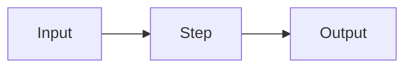

<!--
CANONICAL SESSION GUIDE SKELETON — copy to dayN/guide.md and fill in.
Keep all 12 numbered sections. Delete these HTML comments in the final guide.
Audience: absolute beginners. Explain every term on first use.
Cohort OS: Windows — give WSL2 / Git Bash steps alongside macOS/Linux.
-->

# Day N — <Session Title>

> **Module:** <M#: Name> · **Week <W>, Day <N>** · **<Weekday, Month D, 2026>**
> **Live:** 2 hours (9:00–11:00) · **Self-study:** <X hours> · **Total:** <Y hours>
> **Session code:** BMP-C02-S<NN> (Zoom + Recording)
> **Author:** Md. Jubayer Hossain

<!-- Header must match the CSV row exactly: title, date, durations, code. -->

---

## 1. Learning objectives

By the end of this session you will be able to:

- <verb + measurable outcome>
- <verb + measurable outcome>
- <verb + measurable outcome>

## 2. Prerequisites

- **Prior sessions:** Day <n> (<skill>), …
- **Tools installed:** <tool list>
- **Self-check** — run this; if it prints a version you are ready:

```bash
<one-line check command>
```

## 3. Why this matters

<2–4 sentences of biological / research framing. Why a beginner should care
before touching a command. Use a concrete example (a real experiment or question).>

## 4. Concept primer

<Plain-language theory. Analogies. Define every new term the FIRST time it
appears (also add it to the Glossary). A mermaid diagram is encouraged: -->



## 5. Setup check

Confirm your environment before starting the walkthrough:

```bash
<commands>
```

Expected output:

```
<expected output>
```

## 6. Step-by-step walkthrough

### Step 1 — <what you will do and why>

```bash
<exact command>
```

**Expected output:**

```
<real output>
```

✅ **Checkpoint:** you should now see <observable result>.

### Step 2 — <…>

<!-- Repeat: what + why → command → expected output → ✅ checkpoint. -->

## 7. Common errors & troubleshooting

| Error message | Cause | Fix |
|---------------|-------|-----|
| `<message>` | <cause> | <fix> |
| `<message>` | <cause> | <fix> |

## 8. Exercises

Attempt these before opening `solutions/`. They go from guided to independent.

1. **(Guided)** <task>
2. **(Semi-guided)** <task>
3. **(Independent)** <task>

## 9. Recap / key takeaways

- <one-line takeaway>
- <one-line takeaway>
- <one-line takeaway>

## 10. Glossary

| Term | Meaning |
|------|---------|
| <term> | <plain-language definition> |

## 11. Further reading

- <curated link / doc>
- <paper — from the schedule "Readings" column>

## 12. What's next

Day <N+1> — <next session title>. <One line on how it builds on today.>
